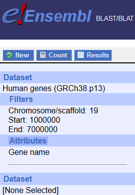

# GeneRIF

This tool is useful when you need to find out what is a function of your genes of interest (in Humans), when you have their gene symbols and want to use information from GeneRIF database. 

What is GeneRIF: https://www.ncbi.nlm.nih.gov/gene/about-generif -  GeneRIF provides a simple mechanism to allow scientists to add to the functional annotation of genes described in Gene 

Gene symbols and their alternatives - HGNC - https://www.genenames.org/

### Downloading files

At the beginning you will need to download GeneRIF and HGNC Gene symbols. Simply run this command:

```
./update.sh
```
Also run this command whenewever you want to update the database

### Filter results for one gene symbol

Set gene name as parameter 1, eg. 

```
./filter_one_gene.sh DNAJC5
```
Results will be saved in filtering folder as eg. filtering/DNAJC5.results.txt


### Filter results for multiple gene symbol

Create a file in filtering folder - one gene symbol per line - and put the name of file as parameter 1, eg. 
```
./filter_multiple_genes.sh file_with_gene_names

```
Results will be saved in filtering folder as eg. file_with_gene_names.results.txt"

#### Example usage

Taks: Find out information about genes from within region of interest, eg. chr19:1000000-7000000

Find which genes are within the region of interest: 

Go to http://www.ensembl.org/biomart/

Get Gene symbols



Save as chr19_1-7mb.genesymbols into filtering folder

Run the query:

```
filter_multiple_genes.sh chr19_1-7mb.genesymbols
```

Find the results in filtering/chr19_1-7mb.genesymbols.results.txt
